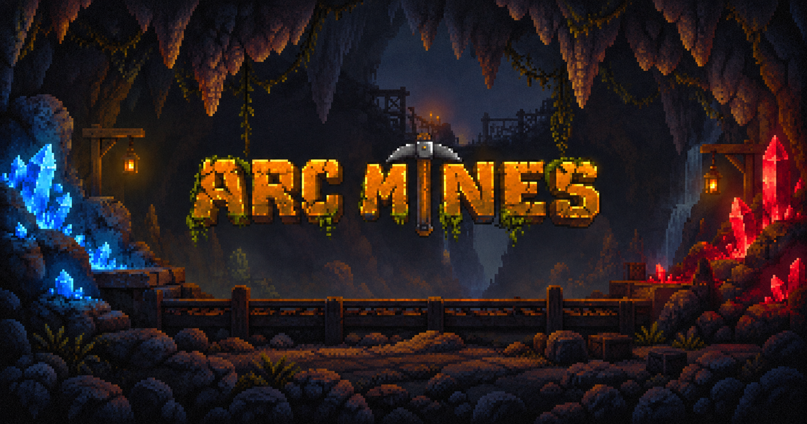

# Arc Mines Agent Kit

**That pause before the ore lands.**

The colours flicker past. The rhythm slows. A shape settles into view, its name
appears, and for a moment the rest of the mine goes quiet.

A good reveal gives you time to feel the discovery. Getting it right takes care:
when the last preview disappears, how the rarity catches the light, where your
thumb goes next. A late response or a jumping button can break the whole moment.

This is the engineering kit behind our approach to ore opening in
Arc Mines. It puts the interaction,
server contract, and failure cases into a workflow a coding agent can follow.
The timing is written down. The tradeoffs are explained. The reference logic
runs locally.

[Start with the skill](skills/reward-reveal/SKILL.md) ·
[Read the workflow](skills/reward-reveal/references/workflow.md) ·
[Explore the research](docs/design-research.md)

## A reveal, down to the last frame

The specification follows the entire opening: the first press, a sixteen-frame
preview that gradually slows, the landing, and the decision to place the ore.
It covers the small things that are easy to leave until the end:

- Space reserved for the result before its name or artwork arrives.
- Rarity you can read in words as well as colour.
- A close button that still works while the request is pending.
- A quiet, static reveal when reduced motion is enabled.
- A stable waiting state when the network takes longer than the animation.
- Focus returning to the right control when you leave.

The [micro-UX specification](skills/reward-reveal/references/micro-ux.md) gives
these details timings, interaction rules, and acceptance checks.

## One opening. One result.

The request starts as soon as anticipation begins. The server selects the ore
and commits the result; the interface waits for both the response and the
presentation to finish before landing it.

If the response disappears on the way back, the same command retrieves the same
reward. Double presses, old snapshots, and reopening the panel must preserve
that identity. Closing an animation cannot undo a committed opening.

The [protocol](skills/reward-reveal/references/protocol.md) covers command IDs,
revision conflicts, cooldowns, atomic receipts, and recovery. An executable
reference checks replay behavior and rejects client-supplied outcomes.

## The references we studied

We reviewed first-party material on **Bonanza**, **Sweet Bonanza**, and
**Ponzi Land**: cascading resolution, the boundary between intermediate and final
results, and economic actions that persist after their presentation ends.

Each study leads to a specific design decision in the kit. The
[research notes](docs/design-research.md) link the original sources and separate
what the games document from our interpretation. The work is a documentation
study, with browser acceptance checks specified for the eventual implementation.

## Keep the work off the critical path

Sixteen preview frames need one opening request. Decorative frames stay on the
client. The server handles selection and settlement without waiting for the show.

For luck-adjusted loot tables, the included sampler compiles cumulative weights
once and uses binary search for each draw. `npm run bench` compares it against
rebuilding weights and scanning on every draw, using synthetic catalogs and
identical inputs.

The benchmark reports timing samples and medians without collecting device,
operating system, account, or runtime identifiers. Results depend on where you
run it. The [performance analysis](skills/reward-reveal/references/performance.md)
explains the comparison, request budgets, contention, and what CPU measurements
can tell you about the complete request path.

## Put an agent to work

Give your coding agent this repository and the following task:

```text
Read skills/reward-reveal/SKILL.md. Implement ore opening in my game using
its workflow, protocol, micro-UX, and performance references. Trace the
existing code first. Preserve the economy and visual language. Verify
lost-response replay, cooldowns, slow requests, keyboard interaction,
and reduced motion. Show what you checked and what remains unverified.
```

The skill folder is self-contained. Read it directly or copy
`skills/reward-reveal` into your agent's skills directory. For focused work,
use the [phase prompts](docs/agent-prompts.md).

Try the reference code with Node.js 22 or newer. No dependencies to install.

```sh
npm test
npm run demo
npm run bench
```

The command model runs in memory. Durable storage and the actual reveal UI are
integration work for the host game, guided by the kit's acceptance criteria.
See [how it connects to Arc Mines](docs/arc-mines.md) and
[how to contribute](CONTRIBUTING.md).

---

Code and documentation are [MIT licensed](LICENSE).
The Arc Mines banner is a [separate brand asset](assets/README.md).
